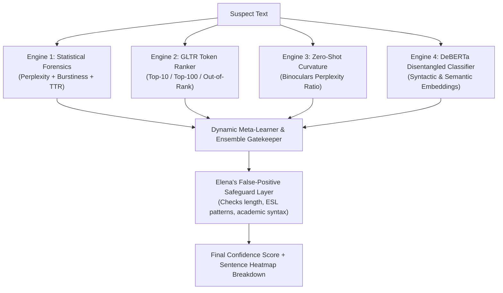

# 🏛️ The AI Council: Architectural Deliberations for "FIND-THE-AI"

> **Chamber Session**: #001 — Designing the Ultimate AI Content Forensics & Detection System  
> **Council Mandate**: Formulate the theoretical foundation, detection algorithms, adversarial countermeasures, and ethical safeguards for identifying synthetic text.

---

## 👥 The 5 AI Council Members

```
                    ┌─────────────────────────────────────────┐
                    │      THE AI COUNCIL CHAMBER (#001)      │
                    └────────────────────┬────────────────────┘
                                         │
       ┌───────────────┬─────────────────┼─────────────────┬───────────────┐
       ▼               ▼                 ▼                 ▼               ▼
┌──────────────┐┌──────────────┐  ┌──────────────┐  ┌──────────────┐┌──────────────┐
│  Dr. Vance   ││ Prof. Thorne │  │  Dr. Chen    │  │  Eng. Volkov ││ Dir. Rostova │
│(LLM Forensics││ (Adversarial │  │ (Stylometry  │  │ (Zero-Shot & ││(Ethics & Bias│
│  & Attention)││  & Evasion)  │  │ & Linguistics│  │ Prob. Space)││  Safeguards) │
└──────────────┘└──────────────┘  └──────────────┘  └──────────────┘└──────────────┘
```

1. **Dr. Aurelia Vance** — *Chief AI Architect & LLM Forensics Lead* (Ex-DeepMind, Specialist in Transformer Attention & Disentangled Representations)
2. **Prof. Marcus Thorne** — *Adversarial Robustness & Evasion Specialist* (Author of RAID benchmark papers, expert in humanizer bypasses)
3. **Dr. Siobhan Chen** — *Computational Linguist & Stylometry Pioneer* (Specialist in Burstiness, Lexical Diversity, and Syntactic Variance)
4. **Alexei Volkov** — *Zero-Shot Probabilistic Systems Engineer* (Creator of curvature-based detection algorithms and Binoculars implementations)
5. **Elena Rostova** — *Ethics, False Positives & Governance Director* (Advocate for non-native speaker protection and calibrated thresholds)

---

## 🎙️ Council Debate Transcript

### Topic 1: What is the Fundamental Flaw in 1st-Generation AI Detectors?

**Dr. Aurelia Vance:**  
> "The first generation of detectors failed because they treated AI detection as a static binary classification problem. They trained a standard BERT classifier on GPT-2 outputs. The moment GPT-3.5 and GPT-4 arrived, their feature space collapsed due to severe distribution shift. We cannot rely on superficial vocabulary cues alone."

**Dr. Siobhan Chen:**  
> "I agree with Aurelia. Language models optimize for conditional probability—they seek the path of least resistance across token sequences. Humans, conversely, write with **burstiness**. A human will write a 32-word compound sentence followed by a 4-word punchy statement. AI models maintain a suspiciously uniform syntactic rhythm and low standard deviation in clause length."

**Prof. Marcus Thorne:**  
> "Let's not be naive about burstiness, Siobhan. The newest 'AI Humanizers' (like Undetectable AI and StealthWriter) specifically inject stochastic sentence splitters to artificially inflate burstiness scores. If your detector only looks at sentence variance, an adversary will bypass you with a 5-line prompt modifier."

**Alexei Volkov:**  
> "Which is why we must operate in the **probability curvature space**. In Binoculars and Fast-DetectGPT, we don't care about surface words; we measure how the text behaves when evaluated against two contrasting models (an Observer and a Performer). AI text occupies a sharp local likelihood peak. When you perturb AI text slightly, its likelihood drops dramatically. Human text sits in a flatter, more rugged energy landscape."

---

### Topic 2: The Multi-Engine Consensus Architecture

The Council unanimously votes to adopt a **4-Engine Hybrid Ensemble Architecture**:



---

### Topic 3: The Threat Matrix & Countermeasures

| Adversarial Attack | How It Bypasses Basic Detectors | Council Countermeasure (FIND-THE-AI) |
|---|---|---|
| **Synonym Swapping** (QuillBot) | Changes high-frequency tokens to lower-frequency synonyms. | **Semantic Embedding Invariance**: DeBERTa contextual attention ignores superficial token swaps. |
| **Punctuation & Length Jitter** | Injects random periods/commas to manipulate burstiness. | **Syntactic Dependency Trees**: Measure grammatical clause depth rather than simple character/word counts. |
| **Prompt Injections** ("Write like a human") | Instructs LLM to use informal slang and typos. | **Curvature Perturbation**: Zero-shot probability drop tests remain consistent regardless of slang. |
| **Mixed Hybrid Editing** | Human writes 50%, AI writes 50%. | **Sentence-by-Sentence Forensic Heatmap**: Color-codes and isolates individual synthetic spans. |

---

### Topic 4: The Golden Safeguard (Elena's Rule)

**Elena Rostova:**  
> "A false positive in academia or industry can destroy careers. We must establish non-negotiable threshold policies:
> 1. **Short Text Quarantine**: Any text under 200 words must be labeled *'Inconclusive / Low Sample Size'*.
> 2. **ESL (English as a Second Language) Bias Correction**: Non-native English writers often use simple vocabulary and predictable structures. We must not flag simplicity as AI generation without high token curvature corroboration.
> 3. **Never Output Absolute 100% or 0%**: Output calibrated probabilistic ranges with confidence intervals and explainable evidence."

---

## 🏛️ Council Decision Summary

The AI Council decrees that **FIND-THE-AI** must serve as both:
1. An **Educational Observatory & Interactive Simulator** that demystifies how synthetic text forensics work for developers, researchers, and users.
2. A **Blueprint for Enterprise-Grade Hybrid Detection** that will evolve into a full-scale backend inference engine.
