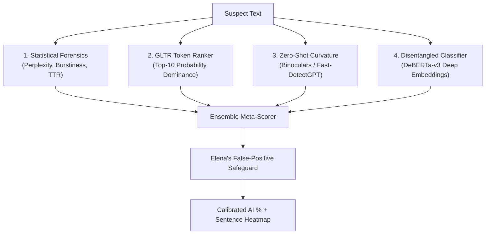

# 🔍 FIND THE AI — Next-Gen AI Content Forensics & Detection Chamber

[](LICENSE)
[](https://github.com/YashDhirajOza/FIND-THE-AI-)
[](https://github.com/YashDhirajOza/FIND-THE-AI-)
[](#)

> **FIND THE AI** is an advanced AI content detection research observatory and interactive simulator. It demonstrates how to mathematically distinguish organic human writing from synthetic Large Language Model (LLM) autoregression through statistical forensics, zero-shot probability curvature, and sentence-by-sentence heatmap inspection.

---

## 🌟 Live Interactive Demo

The project includes an interactive web application that runs directly in your browser with zero installation needed.

```
📁 FIND-THE-AI-/
├── 🏛️ AI_COUNCIL_DEBATE.md   # Architectural deliberations from the 5 AI council personas
├── 🌐 index.html             # High-tech interactive web dashboard & simulator
├── 🎨 style.css              # Cyber-glassmorphism styling & animations
├── ⚡ app.js                 # Client-side forensic simulation algorithms
└── 📖 README.md              # Project documentation
```

### 🚀 How to Run Locally

You can open `index.html` directly in any modern browser, or spin up a quick local web server:

```bash
# Option 1: Python built-in HTTP server
python -m http.server 3000

# Open in browser: http://localhost:3000
```

---

## 🏛️ The AI Council Chamber

Before designing the detection algorithms, an **AI Architecture Council** was convened comprising 5 specialized AI expert personas to debate detection philosophies, adversarial evasion resistance, and ethical safeguards:

| Council Member | Role | Core Philosophy & Specialty |
|---|---|---|
| 🔬 **Dr. Aurelia Vance** | *Chief LLM Forensics Lead* | Disentangled content-position attention embeddings (DeBERTa-v3) to prevent distribution shift. |
| ⚔️ **Prof. Marcus Thorne** | *Adversarial Robustness Specialist* | RAID benchmark evasion invariance; defenses against Undetectable AI & StealthWriter humanizers. |
| 📊 **Dr. Siobhan Chen** | *Stylometry Pioneer* | Burstiness coefficient (\(\sigma / \mu\)) and grammatical clause depth variance. |
| ⚡ **Alexei Volkov** | *Zero-Shot Systems Engineer* | Probability curvature, log-likelihood ratios, and Binoculars cross-perplexity scoring. |
| 🛡️ **Elena Rostova** | *Ethics & Safeguards Director* | False positive prevention, non-native English (ESL) protection, and confidence floors. |

> 📜 Read the full debate transcript in [`AI_COUNCIL_DEBATE.md`](./AI_COUNCIL_DEBATE.md).

---

## 🔬 Core Features of the Simulator

### 1. 🎯 Dynamic Radial AI Probability Gauge
Calculates an aggregate AI likelihood score (0% to 100%) by combining signals across multiple mathematical dimensions.

### 2. 🟩 Interactive Sentence-by-Sentence Heatmap
Color-codes individual sentences from 🟢 *Highly Human* to 🟡 *Mixed* to 🔴 *AI-Generated*. **Click any sentence** to inspect its specific perplexity factor, word count, and cliché marker saturation.

### 3. 🟨 GLTR Token Rank Inspector
Word-by-word visual forensic analyzer inspired by GLTR (Giant Language Model Test Room):
* 🟢 **Top 10 Most Probable** (The LLM sweet spot)
* 🟡 **Top 100 Rank**
* 🔴 **Top 1000 Rank**
* 🟣 **Out of Top 1000 / Creative** (Human idiosyncratic leap)

### 4. 📊 Multi-Metric Forensic Radar
* **Perplexity Score:** Evaluates token predictability against language model distributions.
* **Burstiness Index:** Measures variance in sentence lengths (\(\sigma / \mu\)).
* **Type-Token Ratio (TTR):** Evaluates vocabulary diversity and richness.
* **Top-10 Token Dominance:** Percentage of words falling into the most predictable probability tier.

### 5. 📋 Exportable Forensic Audit Report
Generate and export timestamped markdown or JSON audit reports ready for compliance and review.

---

## 📖 How AI Detection Works: The 5 Core Methodologies



### 1. Statistical & Stylometric Analysis
* **Perplexity:** How surprised a language model is by the text. LLMs pick statistically predictable paths, producing low perplexity.
* **Burstiness:** Humans mix short, punchy statements with sprawling complex sentences. LLMs produce uniform, rhythmic sentence lengths.

### 2. Zero-Shot Probability Curvature (Binoculars & Fast-DetectGPT)
* Compares how text scores when evaluated across an *Observer* model vs. a *Performer* model.
* AI text sits at a sharp local likelihood peak—perturbing it slightly causes a steep drop in likelihood.

### 3. Disentangled Neural Classifiers (DeBERTa-v3)
* Decouples token content embeddings from relative positional vectors, allowing the model to spot abnormal syntactic transitions without overfitting to specific words.

### 4. Source-Side Watermarking (SynthID-Text)
* Pseudo-randomly biases token selection during text generation. A dedicated verifier tests if favored tokens appear more frequently than pure chance.

### 5. Multi-Engine Hybrid Ensemble
* Blends statistical, zero-shot, and neural signals dynamically to resist adversarial evasion tools.

---

## ⚔️ Adversarial Matrix: Catching AI Humanizers

| Attack Vector | How It Bypasses Basic Detectors | FIND-THE-AI Countermeasure |
|---|---|---|
| **Synonym Swapping (QuillBot)** | Replaces high-frequency words with rare synonyms. | **Semantic Embedding Invariance:** DeBERTa attention vectors focus on sentence semantics, ignoring surface swaps. |
| **Burstiness Jitter (StealthWriter)** | Injects arbitrary periods and fragments to fake length variance. | **Grammatical Dependency Depth:** Analyzes subordinate clause hierarchy rather than character counts. |
| **Partial / Hybrid Rewriting** | 50% Human / 50% AI co-authoring. | **Sentence-Level Heatmap:** Isolates synthetic paragraph transitions individually. |

---

## 🗺️ Roadmap to Full Production Engine

- [x] **Phase 1:** Research & AI Architecture Council Deliberations.
- [x] **Phase 2:** Interactive Web Simulator & Forensic Heatmap UI.
- [ ] **Phase 3:** Standalone FastAPI Backend with PyTorch inference.
- [ ] **Phase 4:** Integration with fine-tuned `microsoft/deberta-v3-large` weights on RAID dataset.
- [ ] **Phase 5:** PDF / DOCX file batch scanning engine & Browser Extension.

---

## 👤 Author

**Yash Dhiraj Oza**  
GitHub: [@YashDhirajOza](https://github.com/YashDhirajOza)

---

## 📜 License

This project is licensed under the MIT License — see the [LICENSE](LICENSE) file for details.
